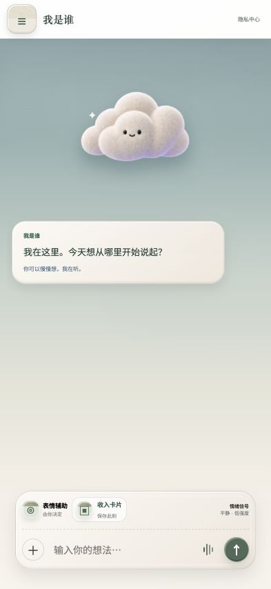

# 模序前后端协作实验

## shiguang_app 功能截图

评委和开发者可直接查看 [`screenshots/`](./screenshots/) 中的 **shiguang_app 全功能截图包**，包含 20 张统一 iPhone 尺寸的清晰页面截图及 ZIP 下载包。



当前仓库已经接入“拾光”移动端 UI，并保留原有的最小前后端契约实验。Node 服务会直接提供 `新版网页/`，同时提供手机号账户接口和“时光”DeepSeek 流式聊天接口。

## 本地运行

```bash
npm install
cp .env.example .env
# 在 .env 中填写 DEEPSEEK_API_KEY
npm run dev
```

访问 `http://127.0.0.1:4173`。

## 初版功能

- 手机号账号、页面验证码、密码注册
- 账号密码登录或账号验证码登录
- “时光”DeepSeek 流式聊天
- 当前正式移动端 UI 与画像、记录、同路人页面
- 密码通过 `scrypt` 加盐保存，模型密钥只保存在服务端

本地初版会把用户写入被 Git 忽略的 `.data/users.json`。验证码会直接显示在当前页面，不发送短信。部署到腾讯云前，只需要把数据适配器替换为 CloudBase 数据库，不需要开通腾讯云短信服务。

## 两个人怎么共同开发

- UI/UX：从 `main` 创建 `feat/ux-v1`，主要修改 `apps/web/`。
- 后端：从 `main` 创建 `feat/api-v1`，主要修改 `apps/api/`。
- 共同格式：修改 `packages/contracts/openapi.yaml` 必须同时更新测试并在 PR 中说明。
- PR 的自动检查通过后再合并，避免一方改坏另一方。

## 四人任务与建议评分权重

评分用于验收任务，不代表成员重要性。每个人都需要提交自己的分支和 Pull Request。

| 角色 | 协作分支 | 主要范围 | 权重 | 验收重点 |
|---|---|---|---:|---|
| UI/UX 与前端 | `feat/frontend-ux` | `apps/web/` | 30 | 页面可用、移动端适配、接口接入正确 |
| 后端与数据 | `feat/backend-api` | `apps/api/` | 30 | 接口可运行、错误处理、记录能力 |
| AI 与契约 | `feat/ai-contract` | `packages/contracts/`、后续 `packages/ai/` | 25 | 输出稳定、字段清楚、前后端都能理解 |
| 硬件与测试 | `experiment/hardware-test` | `tests/`、后续 `prototypes/` | 15 | 摄像头/灯光实验、测试记录、风险说明 |

总分 100。共同加分项：PR 描述清楚、没有越界修改、自动检查通过、能让另一位成员顺利接手。

## AI 协作规则

1. 先从自己的协作分支再创建短任务分支，例如 `feat/frontend-ux/home-v2`。
2. 给 AI 的任务要写明允许修改的目录，以及不能改变的接口字段。
3. AI 如果建议修改 `openapi.yaml`，必须先让前端和后端共同确认。
4. 不把未经检查的大批 AI 代码直接合入 `main`。
5. 最终通过 Pull Request 汇总到 `main`，不把四个人的代码一次性强推覆盖。
