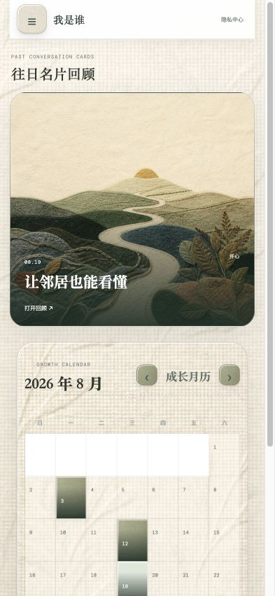
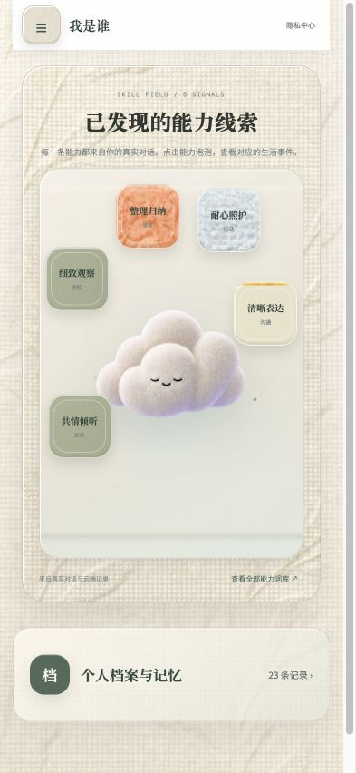
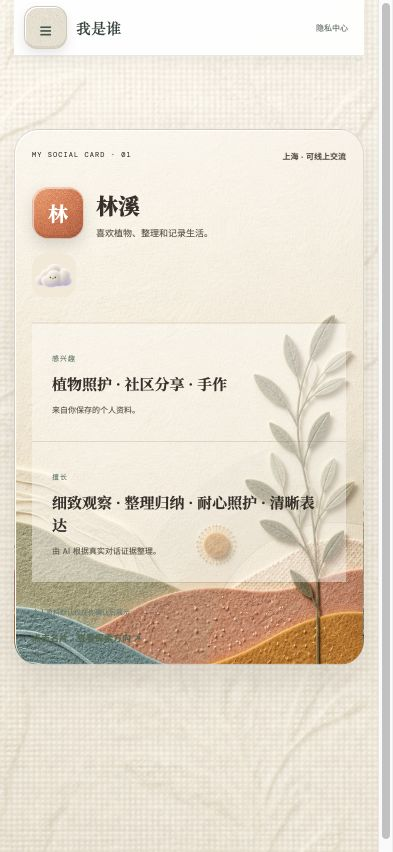
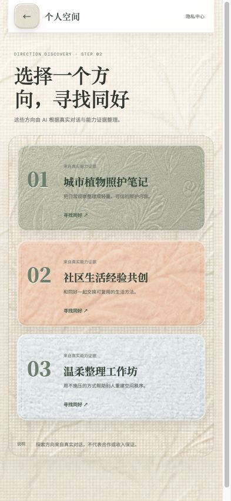
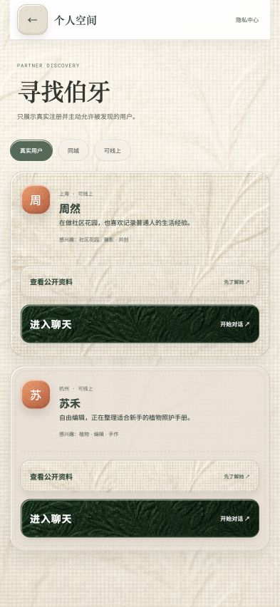
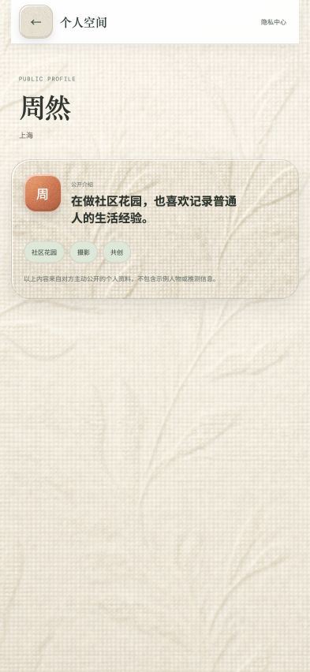
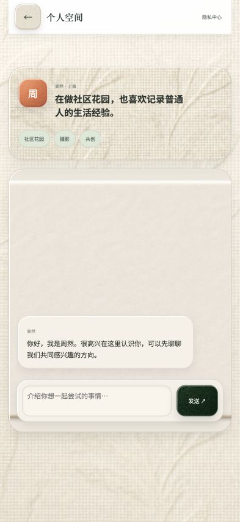

# shiguang_app 功能截图包

最新版移动端功能截图位于 [`shiguang_app_功能全景_2026-08-30/`](./shiguang_app_功能全景_2026-08-30/)，统一采用 393 × 852 的 iPhone 视口，并在页面动画稳定 1 秒后截取。

完整压缩包：[`shiguang_app-功能全景截图-2026-08-30.zip`](./shiguang_app-功能全景截图-2026-08-30.zip)

截图覆盖：对话输入、成长卡片、能力线索、寻找伯牙、探索方向、推荐同好、公开资料、聊天、个人档案、月度与年度回顾、侧边栏、个人信息、摄像头权限、内容导出和隐私中心。

## 主要页面预览

| 对话主页 | 成长卡片 | 能力线索 | 寻找伯牙 |
| --- | --- | --- | --- |
|  |  |  |  |

| 探索方向 | 推荐同好 | 公开资料 | 聊天窗口 |
| --- | --- | --- | --- |
|  |  |  |  |

其余页面可在截图目录中按编号查看。
